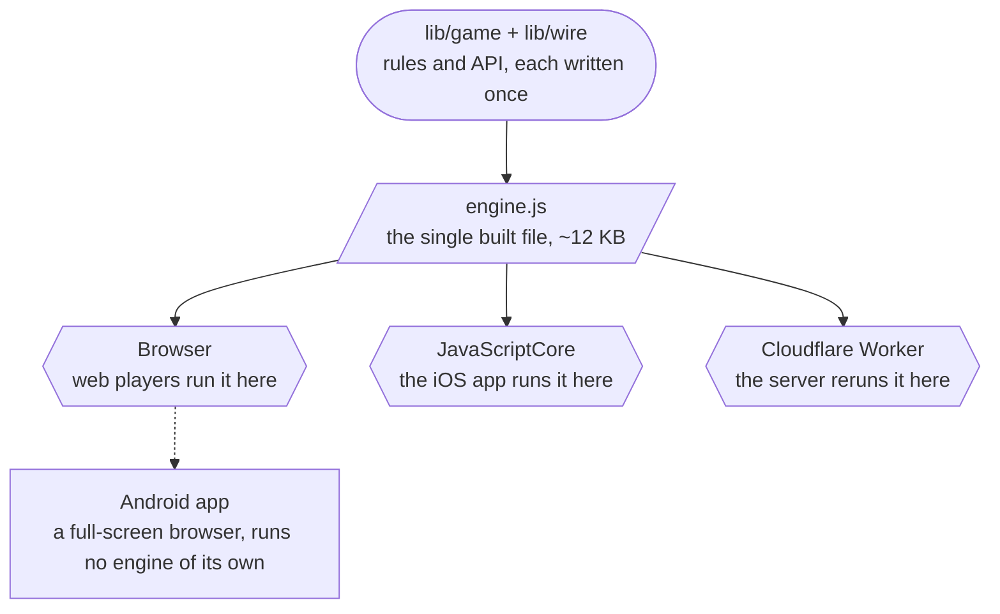
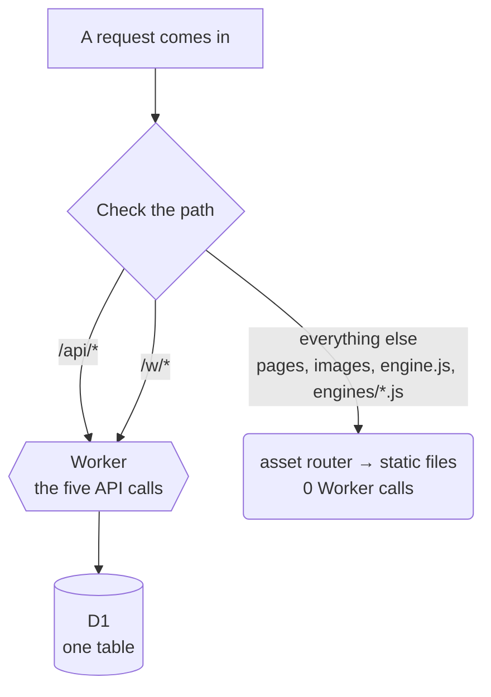
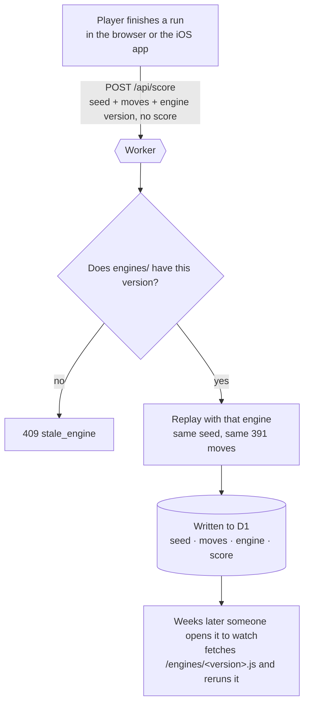
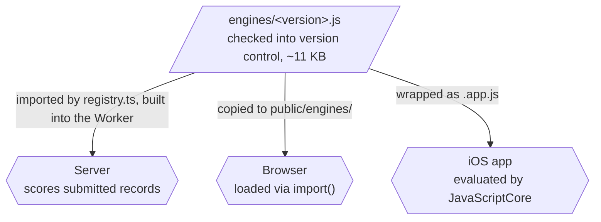
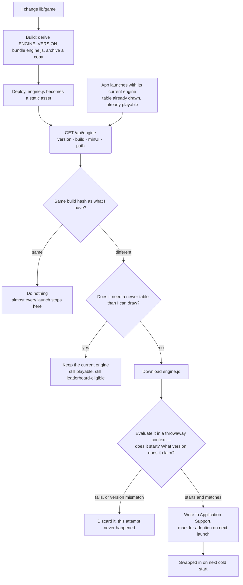
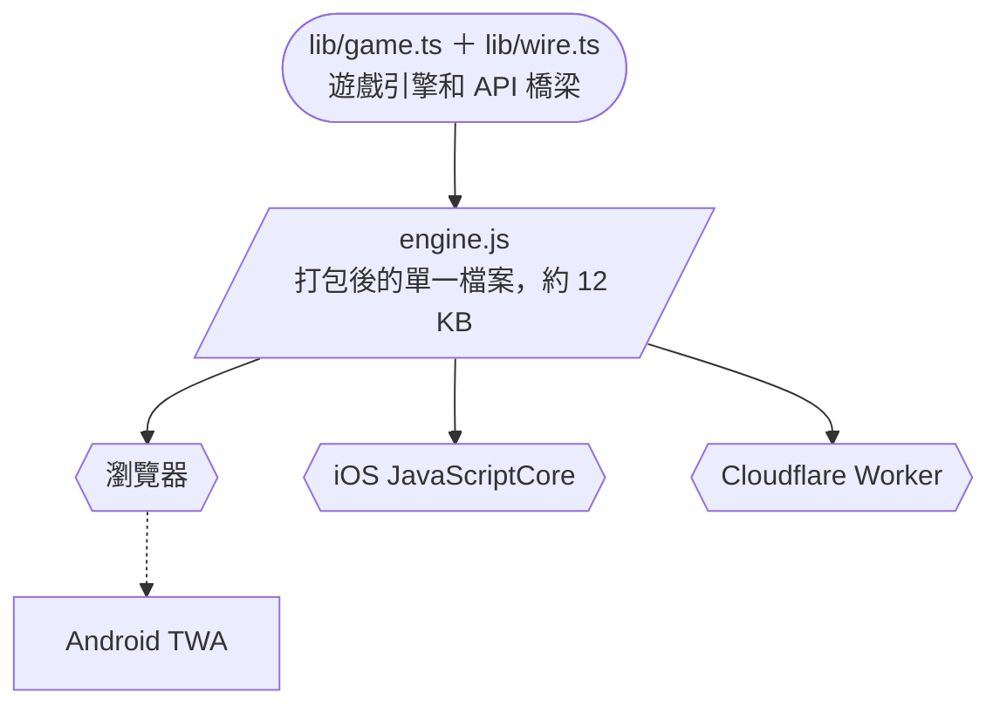
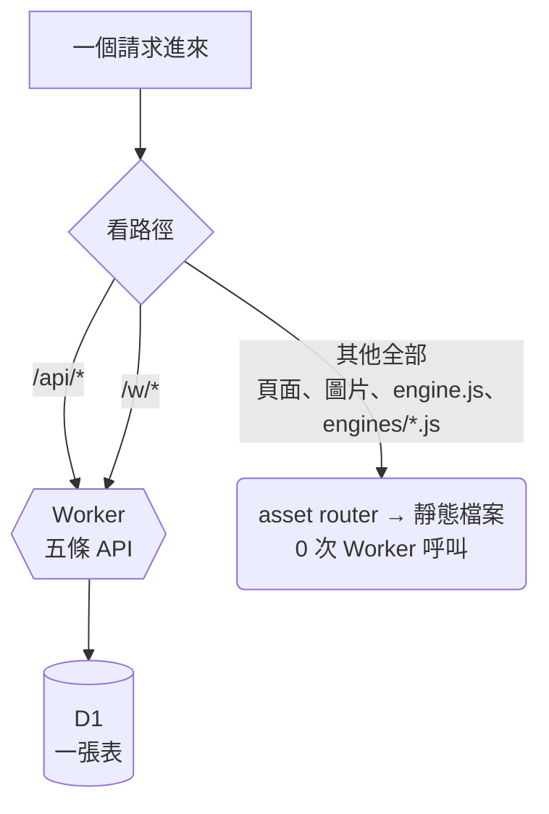
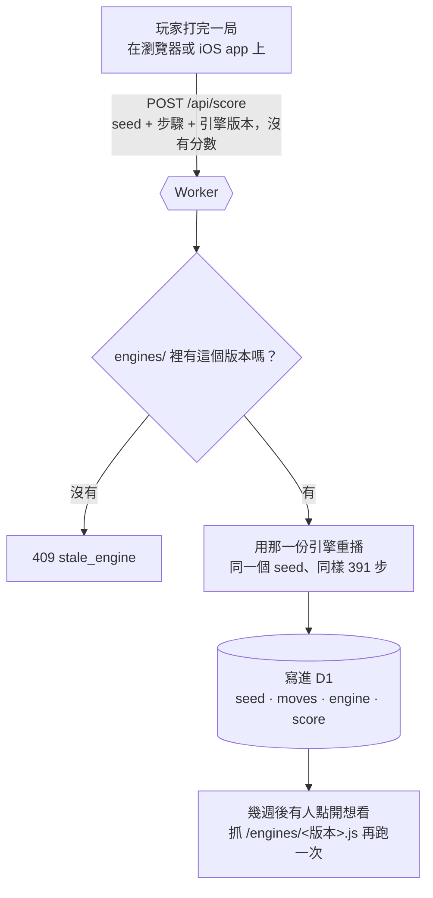
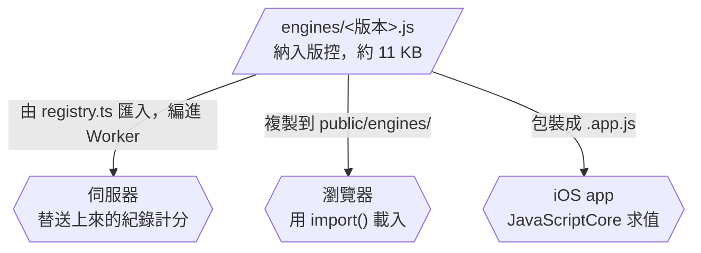
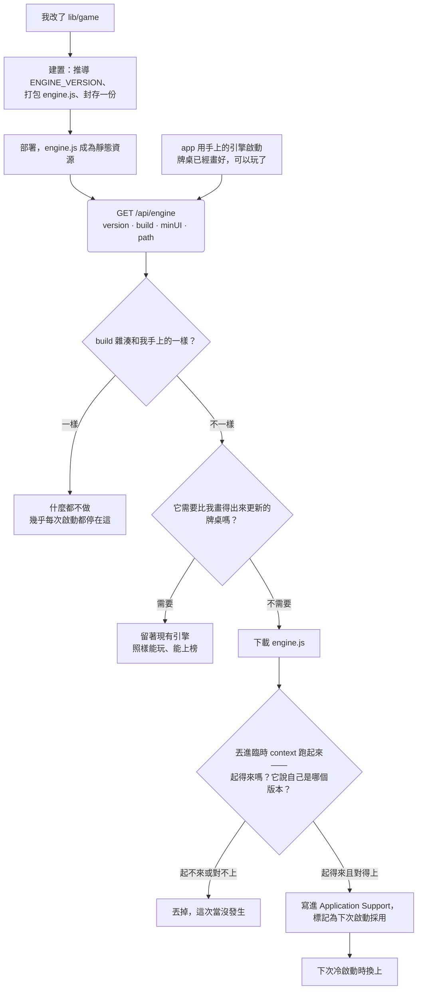

+++
date = 2026-07-26T00:00:00-04:00
title = "[Tefuda] One Engine, Three Runtimes: Web, iOS, and Android Share One Ruleset"
tags = ["TypeScript", "Cloudflare", "Architecture", "iOS", "Indie"]
categories = ["Engineering"]
aliases = [
  "/posts/indie/tefuda-one-engine-three-runtimes-en/",
  "/posts/indie/tefuda-one-engine-three-runtimes-ai/",
]
+++

_[English](#en) · [中文](#zh)_

<a id="en"></a>

## English

[Tefuda](https://playtefuda.com) is a small card game I built. It ships as a website, an iOS app, and an Android app — all three backed by the same server-verified leaderboard.

The combination isn't the hard part. The hard part is that **the same ruleset has to hold in four places at once**: each of the three clients runs it, and the server recomputes the score itself, trusting nothing the client says.

The obvious approach is to write the rules three times — TypeScript for the browser, Swift for the phone, and another copy for the server. The cost is that every bug gets fixed three times, and the moment two implementations disagree, the score depends on which one did the computing.

So there's exactly one copy of the rules.

This post starts with a player's path through the game, answering three questions in order: **who computes what you do on screen? When does anything hit the API? Where does the data live?** The sections after that all deal with different faces of the same headache — **the rules change version, and the three clients don't find out at the same time.**

---

### 1 | Three Apps, but Only Two Ways of Drawing the Table

The differences between the three clients are smaller than they look:

| Client | Who draws the table | Who runs the rules | How the rules update |
| --- | --- | --- | --- |
| **Web** | Next.js static output, running in the browser | Browser | A refresh is the latest version |
| **iOS app** | Native SwiftUI, not a single line of HTML | JavaScriptCore (iOS's built-in JS engine) | Downloads in the background, swapped in on the next cold start |
| **Android app** | It doesn't draw anything — it's Chrome, full-screen | Browser | The moment the site deploys, Android has effectively shipped a release |

The Android row is deliberate: it's a **Trusted Web Activity** — Chrome pointed at `https://playtefuda.com` with the address bar stripped off, backed by the app and the site cross-verifying they're the same product. There isn't a single `.kt` file anywhere in the repo.

So of the three apps, only two places actually run the rules: **the browser**, and **JavaScriptCore inside the iOS app**. The server runs them once more on its own, which makes three — that's what "three runtimes" in the title means.



Three terms get used strictly for the rest of this post:

- **Engine** = the built rules artifact. One file, no imports, no config, no network calls.
- **Runtime** = a host that can run that file: the browser, JavaScriptCore, Cloudflare Workers.
- **Run** = one game, recorded as "a seed plus a sequence of moves" — **never a score**.

---

### 2 | How Many API Calls Does One Run Take? Zero

**From the deal to the final score, an entire run needs no server at all.** The shuffle is determined by the seed; what a move does, what a hand is worth, when an upgrade fires — all of it is pure functions, computed on your own device. The game itself is a static file served directly by Cloudflare's asset router, so a web player never touches the Worker even once.

The server only shows up for four things: **submitting a score, viewing the leaderboard, watching someone else's replay, and — iOS only — asking "is there a new engine build."** The entire API is these five calls:

| Call | When | Sends | Returns |
| --- | --- | --- | --- |
| `GET /api/leaderboard` | Opening the leaderboard | which board (normal / zen / daily challenge), my player id, page | one page of rows |
| `GET /api/replay` | Clicking a row to watch it | which board, which rank | seed, move log, engine version |
| `POST /api/score` | Hitting submit at the end of a run | seed or date, move log, name, player id, engine version — **no score** | the score and rank the server computed |
| `DELETE /api/score` | Deleting your own record | row id + player id | — |
| `GET /api/engine` | Every launch, once the table is drawn | nothing | which engine is live and where to fetch it |

All three clients hit the first four; the last one is **iOS-only**. Two other things go over the network — `/engine.js` and `/engines/<version>.js` — but they aren't API calls, they're static files served by the same asset router, and they never wake up a line of code I wrote.



**Playing the game costs zero Worker requests.** Beyond those four things, the only other thing that touches my code is opening a link someone shared (`/w/*`, covered in section 10).

---

### 3 | Where the Data Actually Lives

Three places, and what's stored barely overlaps between them.

#### (1) On the player's device

The web stores in `localStorage`, iOS stores in `UserDefaults` — **the same set of things, right down to identical key names**, because those keys come from `lib/wire.ts` and both sides read from that same code:

| What's stored | Web (localStorage) | iOS (UserDefaults) |
| --- | --- | --- |
| Player identity (a random id string) | `tefuda_player_id` | same name |
| Display name | `tefuda_player_name` | same name |
| Language / theme / mute | `tefuda_lang` and two others | same names |
| Which daily-challenge days played, score each | `tefuda_daily_v1` | same name |
| Table mid-run | `tefuda_save_v6` | **none** |
| Score that failed to send, waiting to retry | `tefuda_pending_v1` | **none** |
| Next engine to swap in on next launch | **none** | a `.js` file under Application Support + three keys |

The last three rows are platform differences, not inconsistent design: a browser tab can be refreshed at any moment, so the web has to persist the table and any score that failed to send; a phone app that gets swiped away just lives in memory and is right where you left it. Conversely, only iOS needs to persist a new engine to disk — it's the only one whose rules aren't refetched on every open (section 9).

**There's no account here.** No password, no cookie, no session. The player id is a random string the client generates itself; it's not authentication, just a marker meaning "these rows came from the same device." The leaderboard's trustworthiness doesn't depend on it at all — it depends on the replay in section 4.

#### (2) The server's database

D1 (Cloudflare's SQLite), **six migrations, one table**. Every accepted record is one row:

| Column   | Example        | What it's for                                |
| -------- | -------------- | -------------------------------------------- |
| `moves`  | `p0p1c0dd…`    | 391 moves, two characters each               |
| `seed`   | `2880217059`   | which deck was dealt                         |
| `date`   | `2026-07-25`   | which day's daily challenge (or normal mode) |
| `score`  | `608074`       | what it added up to                          |
| `engine` | `7766419a1169` | **which ruleset it was played under**        |

The score is stored, but it **isn't the source of truth — just a cached result of one computation**. The real source of truth is `(seed, moves, engine)`, because those reproduce the score exactly. It's also why replay is possible at all: a viewer isn't fetching a recording, they're rerunning that exact run.

This table is append-only. Beating your own record doesn't overwrite the old row, so an old replay someone else shared doesn't break just because you got better.

#### (3) A directory in version control

Every file under `engines/` is one entire ruleset that was once live, about 11 KB each, all checked into git. Why it has to exist is the subject of section 8.

In other words, **everything the server knows about a given player is a few rows in that table**; everything it knows about the game itself is that table plus that directory.

---

### 4 | How a Run Becomes a Row on the Leaderboard

The first three sections were a static map; this one is the path through it:



Two things in here are the entire design.

**The client sends the actual moves it played, not the score it claims.** The server replays that move sequence with the same seed and trusts only its own result. A tampered record either fails to apply or produces its real score. That's the entire anti-cheat model, and it costs nothing: no obfuscation, no signing, no heuristics.

**The precondition is stricter than it looks.** The server's replay and the player's actual run must agree **to every last digit**. The instant two copies of the rules differ by one character in a scoring table, every score becomes a coin flip between two numbers, and the leaderboard quietly fills up with records nobody actually earned. So sharing code here isn't fastidiousness — it's the only approach that works at all.

---

### 5 | `lib/game`: Rules and Nothing Else

A TypeScript directory, about twenty-five hundred lines, that knows how a deck gets shuffled from a seed, what a move does to the state, how a hand compares to another, what a run is worth. It's all plain functions operating on plain data: `placeCard(state, index)` returns a new state. No React, no DOM, no `fetch`, no storage, no clock, and no randomness that doesn't come from the seed.

That last item matters most: everything here has to be a pure function of `(seed, moves)`, because those are the only two things the server will ever have. The moment one scoring rule asks what time it is, that run can never be verified again. As for what the game **looks like** — animation, sound, layout, copy — none of it lives here, and none of it can ever change a score.

The discipline that takes the most sustained effort is exactly where the boundary of "rules" gets drawn. The Swift app has no table of which hand beats which — it asks the engine at launch; the player-name character limit isn't in Swift either, the app uses the same clipping rule the leaderboard uses to store names. This kind of constant is exactly the thing that's thirty seconds away from being copy-pasted into Swift, and exactly the thing most likely to drift.

**The Swift app knows how to draw this game. It doesn't know how to play it.**

The native bridge is deliberately boring: a headless entry point whose only job is to re-export the engine as a JSON-in, JSON-out interface.

```ts
const TefudaEngine = {
  version: ENGINE_VERSION,
  newDaily: (date: string): string => JSON.stringify(createDailyState(date)),
  apply: (state: string, move: string): string =>
    JSON.stringify(apply(parse(state), move)),
  canDiscard: (state: string): boolean => canDiscard(parse(state)),
  // …
};
```

State crosses the JS↔Swift boundary as a JSON string, decoded on the Swift side with `Codable`. The top of the file states the rule outright: **don't fork logic here, only re-export it**. The moment the native side computes something on its own, it owns a rule — and the same rule held independently on both sides will eventually disagree.

---

### 6 | `lib/wire`: The API Gets Described Exactly Once, Too

The five-call API table in section 2 isn't documentation I wrote up — it's the contents of one file.

Sharing the engine but hand-writing two HTTP clients would just push the duplication out one layer. The iOS app would hold its own copy of paths and parameter names, and it would go stale the first time an endpoint moved — silently, on someone else's device, with no way to fix it short of a resubmission to review.

So the API also gets described exactly once: a pure-function module that holds every path, every query and body key, every response shape, every error code. Both clients are left with nothing but transport. The web side is a thin `fetch` wrapper; the iOS side is a thin `URLSession` wrapper — and it **gets this module from the engine bundle**, holding no endpoints of its own:

```ts
wire: {
  request: (op: string, ask: string): string => { /* → { method, path, body } */ },
  decode:  (op: string, status: number, body: string, ask: string): string => { /* … */ },
}
```

The one thing the Swift side decides for itself is that a request that never went out is called offline. Even which key player identity is stored under, how many characters a name can be, what a share link looks like — all of it is an answer this module supplies on request.

That's how it crosses runtimes: it isn't a library the app links against, it's **data the engine hands over**. Changing one endpoint moves both sides at once — including the version already live on the App Store.

Both constraints were learned the hard way. **It has to be pure**: no `fetch`, no touching storage, the DOM, or `process.env`, because it runs inside a bare JavaScriptCore environment where `URL`, `btoa`, and `TextEncoder` simply don't exist — base64url is hand-rolled as a result. **It has to stay outside the replay closure**, for the reason in the next section.

---

### 7 | `ENGINE_VERSION`: A Version Number Nobody Types by Hand

Up to this point, "there's exactly one copy of the rules" already holds. But that only solves "the rules are the same set" — not "the rules are the same set right now," and the second one is the hard part. A browser tab keeps running whatever JavaScript it originally loaded; a deployment doesn't touch it. The native app only adopts a downloaded engine on its next cold start, and a phone usually suspends the app for days rather than closing it.

So every build derives an `ENGINE_VERSION`: a hash of "the modules a replay actually passes through" — the closure esbuild resolves out from the replay entry point. Two runtimes holding the same string are guaranteed to compute the same score for the same move sequence; different strings guarantee nothing. The leaderboard relies on exactly this contract, and it's the content of the `engine` column from section 3.

**What gets hashed is the minified output, not the source.** Every version bump invalidates any run currently in progress, so editing a comment, reordering a block, renaming a local variable shouldn't cost anyone a run they're halfway through. Minification erases exactly those things while preserving everything that can affect a score. The cost is that esbuild's own version becomes an input too — rare, and it fails in the safe direction: it can only trigger an extra bump, never miss one it should have made.

**It's derived, not declared**, because "forgot to bump it by hand" is exactly the mistake this mechanism exists to catch. The script also guards against the hash becoming an input to itself: if the generated version file ends up inside the closure being hashed, the build fails outright.

This is also why `lib/wire` has to stay outside the closure. If it were inside, moving one endpoint would bump the version and invalidate every run in progress — paying a game-rules bill for a networking-layer change.

---

### 8 | `engines/`: Old Rules Don't Get Thrown Away

The server's first version enforced an exact version match: any record played under a different string got `stale_engine`, no exceptions.

That was the right answer to the wrong question. A deployment doesn't **update** a client someone is mid-run on — it just **leaves them behind**. A web player would lose the run in progress; an iOS player, who's never forced to close the app, could be locked out for days, unable to submit anything. And the whole time, the ruleset their run was following still exists, still perfectly well-defined.

So the server keeps them. Every deployed engine gets archived as a bundle named after its own version and checked into version control; a submitted record gets replayed under **the ruleset it declares**, not today's:

```ts
const rules = typeof engine === "string" ? ENGINES[engine] : undefined;
if (!rules) return json({ error: "stale_engine", engine: ENGINE_VERSION }, 409);
```

Two things it deliberately doesn't do. It doesn't recompute an old record under the new rules — that would be a number nobody ever actually played to get. And it doesn't trust anything the client claims — an archived engine replays a record exactly the way the live one does, so a run submitted under an old version is just as verified as one under the new one. `stale_engine` collapses down to what it should mean: old enough that the archive no longer carries that engine at all.

#### Where an old engine actually lives

The word "archived" carries too much implied meaning. **An archived engine is a file** — not a container image, not a blob in a database, not a service still running somewhere:

```
engines/7766419a1169.js       11 KB, checked into version control
```

Self-contained, minified JavaScript, bundling in only the replay entry point, exporting two or three functions, with no imports, no config, no network calls:

```js
export { rr as replayDaily, tr as replayFree };
```

`git log` has it, an editor can open it, and it'll still run in five years, because it doesn't depend on anything. And **the same bytes have three readers**, so the build copies it out to wherever each one can reach it:



The third one needs that wrapper because JavaScriptCore has no module loader — an `export` in a script is a syntax error. So the build produces one more form, rewritten onto a global instead. Its input is **the archive file's own bytes**, not a recompile of the source: rebuilding from source could produce something subtly different from the copy the server scores against, and then the number on screen and the number on the board would stop agreeing.

#### Thirteen rows that couldn't be watched

**The part that breaks silently is the last step.** The `engine` column is, in effect, **a foreign key pointing at a file in a directory**, and nothing protects it: no `REFERENCES`, no migration, no type. Delete the file, and the column still says `7766419a1169`, and the row still shows `608074`, because that number was already computed and stored at submit time. Only the replay breaks.

I know exactly how this breaks because I did it. The archive kept the six most recent versions, and thirteen rows pointed at a seventh. Nothing errored, no test failed, not one line of log fired — the board looked completely fine. The only symptom was those thirteen replays freezing halfway through with the counter still showing the full length: today's engine deals a different deck and rejects a move that no longer fits. It looks exactly like a broken feature.

**The lesson is that "keep the most recent N" was the wrong shape to begin with.** The engine serves two different needs, with two different lifetimes:

- **Submitting a score** — a client still running that version. This window **ends**: a tab refreshes, a phone's next cold start updates it.
- **Replay** — every row that names it. This window **never ends**, because a row sits on the all-time leaderboard until someone beats it.

Letting release cadence decide archive depth answers the first need and ignores the second — and the second is the one that was actually binding all along. What should be kept isn't "six versions" or "three months," it's **every version named by any row still alive**. So this is now a query, not a guess:

```
version        rows    verdict
4c8e230326bc      3    this build — never drop
7766419a1169     16    needed: 16 rows replay through it
f4cacd061554     13    needed: 13 rows replay through it
e99a0a3e2210      0    no row needs it — droppable
```

Two facts that live in different places — a file directory and a SQLite column — get put side by side. Nothing else in the system sees both at once, which is exactly why this went wrong in the first place.

A missed archive says nothing at runtime, so archiving isn't a habit, it's a build step: `predev` writes the archive, `prebuild --check` verifies it and fails the build if it's stale, and a pre-commit hook regenerates it. There's one more safety line: `--recover <commit>` rebuilds a missing bundle using `git archive <commit>` instead of the working tree, because a version's ruleset is exactly the source at that commit. That cuts both ways as a warning: **squash away the commit that produced a version, and that ruleset is gone permanently** — along with any run ever played under it.

I recovered those thirteen rows, but only through luck: the commit that produced that bundle had already been squashed away, and the file survived as an unreachable blob in git's object store that hadn't been garbage-collected yet. `git cat-file -p f2cc99af67b6` handed back 11 KB that reproduced all thirteen stored scores exactly. That wasn't a recovery procedure. That was a near miss.

---

### 9 | OTA: Getting New Rules Into an App That's Already Running

The previous section was about records played under old rules. This one runs the other direction: how a client gets the **new** ones. Web and Android just refresh; only iOS has this problem, because it's the only client carrying its rules with it.

#### Why bundle an engine into the app at all

The question I get asked most: since the engine is just JavaScript, why doesn't the app simply fetch the latest one on every launch, play an update animation, and store it? Because that puts a network dependency on the launch path, and the game itself needs no network at all.

1. **The first launch has to be playable.** Fresh install, on a plane, in the subway. If the engine only ever comes from the network, the app is an empty table the moment there's no network — and App Review will open it on genuinely bad connections.
2. **Launch shouldn't wait on the network.** Blocking the table on every single launch for a 12 KB file that changes about once a month isn't a good trade. The order runs the other way: the table draws first and becomes playable, and only then does a `.task` ask the server in the background. The player never sees it happen.
3. **Even once it's fetched, it can't swap in immediately.** Changing engines changes how the deck gets dealt; swapping mid-run would mean the table in front of the player and the score a later replay computes stop agreeing. So a new engine is always held back until the next cold start — and if it has to survive across launches, there has to be a local copy of "the engine to boot with" in the first place.
4. **It's a fallback.** If the stored bundle fails to start up, the app falls back to the one built into the binary. Without that built-in copy, this fallback would collapse into "the app won't open."

So the copy built into the app is the **floor** and the one on the server is the **ceiling**. The floor is just as playable and just as leaderboard-eligible, because the server replays under whatever version that run declares (section 8).

This is the same shape as CodePush or Expo Updates: a baseline in the binary, a background fetch, applied on the next launch. The only difference is that most of them default to blocking the splash screen on the download; Tefuda doesn't — a 12 KB rules diff isn't worth making anyone stare at a loading screen one second longer. And to scope it honestly: this isn't a code-push framework, it's **one hash comparison plus one file download**.

#### The flow, including every branch where it decides not to update



What the server hands back is a pointer, not the content — almost every launch, it's just a hundred-odd bytes:

```ts
{
  version: ENGINE_VERSION,    // which ruleset
  build: sha256(servedBytes), // which bytes
  minUI: MIN_APP_UI,          // oldest UI version that can draw the table
  path: '/engine.js',         // a path, not an absolute URL
  accepts: ENGINE_HISTORY,    // every version the archive can still replay
}
```

**Why `version` alone isn't enough.** `ENGINE_VERSION` only hashes the replay closure, but the bundle holds more than that closure: `lib/wire`, the tutorial, and the bridge interface are all in there. So changing the wire protocol produces different bytes under the same version string; an app that only checks `version` would stay stuck on the old bundle forever, with zero symptoms, because everything it used to be able to do it still can. This isn't hypothetical: that's exactly how the new `wire.enginePath` shipped — before `build` was added, an already-installed app never picked it up at all. **The version says which ruleset; the hash says which bytes.**

**What OTA can update**: anything in the bundle that's JavaScript — the scoring table, deck composition, what a move does, daily-challenge variants, the wire protocol, the tutorial script. **What it can't update**: Swift. A bundle can teach the app new numbers, but it can't teach it to draw a control that doesn't exist in the binary. That's what `minUI` is for. Concretely: zen mode has no clock and no discarding, so a table built before zen existed would print "−1 placements remaining" next to a goal that can no longer time out, with a button beside it that does nothing when tapped. Nothing crashes — the screen is just describing a different game. An app below `minUI` keeps its current engine and keeps submitting scores just fine; this is a caution, not a cliff.

**Security, honestly stated.** This bundle isn't signed. Transport is HTTPS to the same origin the app already talks to, and the server returns a **path**, not an absolute URL, so nothing on the server can point the device at a different host. Integrity is checked by trying it: a downloaded bundle is evaluated in a throwaway context and asked what version it is, and only gets stored if it starts up and matches the manifest. None of this has to carry much weight, because **the server never trusted the client's engine to begin with** — tampering with the bundle on your own phone changes only what shows up on your own screen. What signing would protect here is a player not fooling themselves.

**What happens when it breaks.** Every failure path resolves to the same outcome: the app keeps running whatever it's already running:

- Offline, 500, 404 → this update attempt is silently skipped, retried next launch.
- Bundle fails to start → discarded before it's ever stored.
- A stored bundle turns out not to start at launch → the app falls back to the engine built into the binary and discards the stored one. That fallback is the difference between "this update didn't take" and "the app won't open."
- **The app itself ships a newer engine than what's stored** → the stored one gets discarded. This is the rollback case, and the one I got wrong twice. There's no inherent ordering between two version hashes, so the app compares "the bytes of the engine currently built into the binary" against "which one the stored copy was staged on top of." It used to compare build numbers instead — a local rebuild never touches that number, so a stored bundle would outrank every rebuild, and the JavaScript running on the phone ended up months older than the app surrounding it.

**Web's OTA is just a reload**, and the design question is entirely **when**. No prompt, no mid-run swap: it reloads at the one moment there's genuinely nothing to lose — a table that's been dealt but never touched. That covers exactly the cases that actually happen: a tab left open overnight, a deploy landing while you're sitting on the results screen. The native app makes the same trade-off, just moving that moment to the next cold start.

One detail worth stealing: that reload also has to **discard the saved state** rather than resume it. The deck on screen was dealt by the engine being left behind, and the new engine can deal differently from the same seed — resuming would replay that move sequence into a score the player never actually saw. Since not a single move has been made yet, discarding costs nothing. It also remembers to only try each version once, otherwise a client that genuinely can never get the new version (a static cache still serving yesterday's HTML, a proxy stuck in the middle) would reload forever.

---

### 10 | The Worker: Where the Server Actually Sits

The server is one Cloudflare Worker, five API paths, and its most important design decision is making sure it runs as rarely as possible.

**The trust boundary sits at the replay, not at the request.** CORS is opened to `*` deliberately: these endpoints carry no cookies, every score gets replay-verified, and the origin a request comes from was never the trust boundary to begin with. (Using `*` instead of echoing back the origin also means the cached leaderboard doesn't need `Vary: Origin`.) Rate limiting is deliberately light — the player id is something the client picks for itself, so the most it can do is throttle how fast a single client can flood the table. What actually holds up the leaderboard is that every row gets replayed by the server itself.

**Cache-Control is the infrastructure.** No queue, no cache layer, no Redis — just four numbers: 30 seconds for the leaderboard, 300 seconds for a replay, 300 seconds for the engine manifest, one hour for a share card. The manifest is short because it's the only buffer between "the rules changed" and "the client hasn't found out yet"; a share card and its image share the same one-hour window, so the number on the image and the number in the text can never disagree.

**Persistence is boring SQL.** D1, six migrations, one table, plain `prepare().bind()`. Deletion is scoped to `(id, player)`, and a row's id is only ever returned to its own owner — even a leaked id can't delete someone else's record.

**A shared run travels with the link, it isn't stored.** A share link puts the entire run — seed and move log — right in the path, and the server holds no data about it: the link works offline the instant it's created, can never 404, and no row being deleted can invalidate it. The score isn't in there either — whoever opens it replays the log themselves.

This is also why the Worker serves HTML at all (the `/w/*` in the routing diagram). The table reads that run out of the URL's **fragment**, and a fragment never gets sent to the server — a crawler sees nothing but the bare page, and every share would preview as the same empty table. So the Worker answers that path with a `head` naming the specific run, then sends a real browser on to the fragment:

```html
<script>
  location.replace(target);
</script>
```

That costs one call per link opened or crawled, not one per player. Nothing in that `head` is trusted straight off the link: the name is clipped by the same rule the leaderboard uses, and the score is computed by replay, never read off the payload. A number sitting in a URL is just a claim; a claim rendered into a preview card is a claim with a picture attached.

The image itself gets drawn inside the Worker: an SVG rasterized through `resvg-wasm`, fonts imported in as raw bytes, because there's no filesystem to read from there. Two things I got wrong at first: `initWasm` can only be called once per isolate and throws on the second call, so the guard has to be the promise itself; and the pixels have to be copied out of wasm memory before the function returns, because the response body only gets read after the function has already returned.

---

### 11 | What This Shape Makes Cheap

None of the following is done today:

- **A fourth runtime is nearly free.** Anything that can run 12 KB of zero-dependency JavaScript can play or verify a run — a Deno script, a Discord bot, a native Android shell for whenever the TWA stops being enough. What has to be ported is the bridge file, not the rules.
- **Archive auditing belongs in CI.** The query that cross-checks `engines/` against the `engine` column already exists — it's just not wired to anything that fails a build yet. The thirteen-row incident happened exactly in the gap between "a check exists" and "the check runs itself."
- **Signing the bundle** becomes important on the day the engine starts deciding something the server doesn't independently recompute. Today it doesn't, and that's the only reason a run-it-and-see check is enough.
- **Keeping one more archived version costs 12 KB.** The current depth is decided by how many versions the board still names, not by what the Worker can fit.

---

### 12 | Five Things I'd Do the Same Way Again

1. **When two sides must agree, make the build produce that agreement — don't write it in a doc and hope someone remembers.** A shared constant retyped into a second language is a failure with a release date already on it.
2. **Derive the version number from whatever can change the answer.** Hash the minified closure, not the source: formatting is free, semantics is what gets billed. And never bump it by hand.
3. **Prefer compatibility to enforcement.** Blocking an old client doesn't make it new, it just leaves it behind; keeping its old rules around costs a directory of 12 KB files.
4. **Whatever fails silently at runtime, make it fail loudly at build time.** A missed archive says nothing at runtime; `prebuild --check` fails the build outright.
5. **Put the server only where a server is genuinely needed.** Five routes, and the game itself never touches one of them.

---

### Appendix | Types for the Five API Calls

The table in section 2 was the version for people; this is the same thing for the compiler, with shapes taken from `lib/wire`:

```ts
type LeaderboardRequest = {
  board: "all" | "zen" | `daily:${string}`; // normal / zen / a given day's daily challenge
  playerId: string;
  page: number;
};
type LeaderboardResponse = {
  rows: { rank: number; name: string; score: number; playerId: string }[];
  page: number;
  hasMore: boolean;
};

type ReplayRequest = { board: string; rank: number };
type ReplayResponse = { seed: string; moves: string; engine: string };

type ScoreRequest = {
  seed?: string; // normal / zen
  date?: string; // daily challenge: date replaces seed
  moves: string;
  name: string;
  playerId: string;
  engine: string;
  // no score — the server replays (seed, moves, engine) to compute it
};
type ScoreResponse = { score: number; rank: number };

type DeleteScoreRequest = { id: string; playerId: string };
// response: 204, no body

type EngineManifest = {
  version: string; // which ruleset
  build: string; // which bytes
  minUI: number; // oldest UI version that can draw the table
  path: string; // a path, not an absolute URL
  accepts: string[]; // every version the archive can still replay
};
```

`ScoreRequest` has no `score` field, and that's not an omission — it's what all of section 4 was about. `DeleteScoreRequest` scopes itself with `(id, player)` together, the deletion rule from section 10. And `version` and `build` existing as separate fields is the distinction from section 9: one names the ruleset, the other names the bytes.

---

<a id="zh"></a>

## 中文

### 序｜Tefuda 如何優雅地跨平台

[Tefuda](https://playtefuda.com) 是我做的一款跨平台卡牌遊戲，同時有網頁版、iOS app 和 Android app，三個平台共用著同一個由伺服器驗證的排行榜。

為了防止用戶端透過如 `curl` 等方式惡意灌分，**同一套遊戲引擎（遊戲規則）要同時在三個用戶端和伺服器成立**，這個組合本身很常見，但如何保持乾淨、易維護的架構，是本文想探討的重點。要解決這個問題，最直覺能想到的做法是把遊戲引擎的邏輯重複四次，一個常見的組合為：

| 瀏覽器     | iOS   | Android | Cloudflare Worker |
| ---------- | ----- | ------- | ----------------- |
| TypeScript | Swift | Kotlin  | TypeScript        |

上述做法有一個顯而易見的代價，一旦出了 bug 的話，需要修四次，並且會有 4 倍的維護成本，浪費 token 的問題。比較好的做法是，**只維護一份遊戲引擎**，至於要怎麼維護，還請耐心看完本篇文章。

---

### 0｜三個核心問題

本文將會從玩家的視角談起，依序地回答以下三個問題：

1. 前端的遊戲內容是如何被計算的？
1. 什麼時候打 API？
1. 資料存在哪？

後面的章節則會探討同一個棘手問題的不同面向——**遊戲引擎改版了，但三個用戶端卻沒有同步得知**。

---

### 1｜三個 app，兩個前端

| 用戶端 | 誰畫牌桌 | 誰跑遊戲引擎 | 遊戲引擎怎麼更新 |
| --- | --- | --- | --- |
| **網頁** | Next.js 靜態輸出，跑在瀏覽器裡 | 瀏覽器 | 重新整理就是最新的 |
| **iOS** | 原生 SwiftUI | JavaScriptCore（iOS 內建的 JS 引擎） | 背景下載，下次冷啟動時換上 |
| **Android** | 網頁鑲嵌，其實就是全螢幕的 Chrome | 瀏覽器 | 網站部署完，Android 就等於出了一版 |

Android 因為不像 iOS 有 Liquid Glass 原生 UI/UX 的需求，為了加快開發速度，Android app 採用了 Trusted Web Activity (TWA) 的架構來呈現全螢幕網頁。這架構最大的優勢在於 Android 不需要耗費資源執行遊戲引擎，僅需負責全螢幕渲染 [https://playtefuda.com](https://playtefuda.com)。整體實作極度輕量化，專案庫（repo）中完全沒有使用到任何 `.kt` 檔案，app 僅作為一個 web wrapper 存在。



本文接下來將嚴格使用以下三個術語：

- **遊戲引擎**（Game Engine）＝ 原始碼 `lib/game.ts` 打包出來的產物。一個檔案，沒有 import、沒有設定、沒有網路呼叫。
- **執行環境**（Runtime）＝ 能跑這個檔案的宿主：瀏覽器、JavaScriptCore、Cloudflare Workers。
- **單局**（Run）＝ 一場遊戲，紀錄成「一個 seed + 一串步驟」。**分數不存在紀錄裡，是從這兩樣東西算出來的**。

---

### 2｜玩一局 Tefuda 會呼叫幾次 API？

**從發牌開始到結算分數，整局遊戲不需要伺服器**。洗牌由 seed 決定；一步做了什麼、一手牌值多少分、什麼時候進到下一關，全是純函式，在你自己的裝置上算完。因為遊戲本身是個靜態檔案，直接由 Cloudflare 的 asset router 提供，所以網頁版玩家根本不會打到 Worker。

只有在四種情況下會用到伺服器：提交分數、看排行榜、看別人的重播，還有（只有 iOS 才有）詢問「是否有新的遊戲引擎 build」。完整的 API 就是以下這五個請求：

| 呼叫 | 什麼時候 | 送什麼 | 回什麼 |
| --- | --- | --- | --- |
| `GET /api/leaderboard` | 打開排行榜 | 哪個模式（一般／禪／每日挑戰）、我的玩家 id、分頁 | 一頁的列 |
| `GET /api/replay` | 點開某一列想看 | 哪個板、第幾名 | seed、步驟紀錄、引擎版本 |
| `POST /api/score` | 一局結束按送出 | seed 或日期、步驟紀錄、名字、玩家 id、引擎版本，**沒有分數** | 伺服器自己算出來的分數和排名 |
| `DELETE /api/score` | 刪掉自己的紀錄 | 列的 id ＋ 玩家 id | — |
| `GET /api/engine` | 每次啟動，牌桌畫好後 | 什麼都不送 | 現在線上是哪個引擎、去哪抓 |

前四條三個用戶端都會打，最後一條**只有 iOS**。另外 `/engine.js` 和 `/engines/<版本>.js` 也走網路，但它們不是 API 而是靜態檔案，一樣由 asset router 送，不會叫醒任何一行程式碼。



**玩這款遊戲要花的 Worker 請求數是零。** 除了上面那四件事，只剩打開別人分享的連結（`/w/*`，第 10 節細講）。

---

### 3｜資料存在哪

三個地方，而且幾乎不重疊。

#### (1) 玩家的裝置上

網頁存在 `localStorage`、iOS 存在 `UserDefaults`，**存的是同一組東西，連 key 的名字都一樣**，因為那些 key 是 `lib/wire.ts` 給的，兩邊從同一份程式碼讀：

| 存什麼 | 網頁（localStorage） | iOS（UserDefaults） |
| --- | --- | --- |
| 玩家身分（一串隨機 id） | `tefuda_player_id` | 同名 |
| 顯示名稱 | `tefuda_player_name` | 同名 |
| 語言／主題／靜音 | `tefuda_lang` 等三個 | 同名 |
| 每日挑戰打過哪幾天、各拿幾分 | `tefuda_daily_v1` | 同名 |
| 進行到一半的牌桌 | `tefuda_save_v6` | **沒有** |
| 送不出去、等重試的成績 | `tefuda_pending_v1` | **沒有** |
| 下次啟動要換上的新引擎 | **沒有** | Application Support 底下一個 `.js` 檔 ＋ 三個 key |

最後三列是平台差異，不是設計不一致：分頁隨時會被重新整理，所以網頁得把牌桌和送不出去的成績寫下來；手機 app 被切走時整個活在記憶體裡，回來就還在原地。反過來，只有 iOS 的遊戲引擎不是每次開啟都重抓（第 9 節），所以只有它需要把新引擎存到磁碟。

**這裡沒有帳號。** 沒有密碼、沒有 cookie、沒有 session。玩家 id 是用戶端隨機產生的一串字，不是身分驗證，只是「這幾列來自同一支裝置」的標記。排行榜的可信度完全不靠它，靠的是第 4 節的重播。

#### (2) 伺服器的資料庫

D1（Cloudflare 的 SQLite），**六個 migration，一張表**，每一筆被接受的紀錄就是一列：

| 欄位     | 例子           | 用來做什麼                     |
| -------- | -------------- | ------------------------------ |
| `moves`  | `p0p1c0dd…`    | 391 步，每步兩個字元           |
| `seed`   | `2880217059`   | 當初發的是哪一副牌             |
| `date`   | `2026-07-25`   | 哪一天的每日挑戰（或一般模式） |
| `score`  | `608074`       | 此局的分數                     |
| `engine` | `7766419a1169` | **哪一套遊戲引擎下運作的**     |

分數雖然存著，但它**不是事實來源，只是一次計算的快取**。真正的事實是 `(seed, moves, engine)`，因為它們可以把分數精準重算出來。這也是重播之所以可能的原因：觀看者不是在抓一段錄影，而是把那一局重跑一次。

#### (3) 版控裡的一個目錄

`engines/` 底下每個檔案是一整套曾經上線過的遊戲引擎，各約 11 KB，全部納入 git。它為什麼必須存在，是第 8 節的內容。

換句話說，**伺服器上關於一位玩家的全部，就是那張表裡的幾列**；關於這款遊戲的全部，就是那張表加上那個目錄。

---

### 4｜一局怎麼變成排行榜上的一列

前三節是靜態的地圖，這節是動線：



裡面有兩件事就是整個設計。

**用戶端送的是它實際打過的每一步，不是它宣稱的分數。** 伺服器用同一個 seed 把步驟重跑一次，以自己的結果為準。被動過手腳的紀錄，不是套用失敗，就是跑出它真正的分數。整個防作弊模型就這樣，成本是零：不需要混淆、簽章或任何啟發式判斷。

**前提比看起來嚴格。** 伺服器的重播和玩家當下那一局必須**每一位數都一致**。兩份遊戲引擎只要有一張分數表差一個字元，每筆分數就是兩個數字之間的擲硬幣，排行榜會安靜地被沒人真的打出來的紀錄填滿。所以共用程式碼在這裡不是潔癖，是唯一可行的做法。

---

### 5｜`lib/game`：只有遊戲引擎，別的都不放

一個 TypeScript 目錄，兩千五百行左右，知道牌怎麼從 seed 洗出來、一步棋對狀態做了什麼、一手牌怎麼比大小、一局值多少分。裡面全是對單純資料做事的單純函式：`placeCard(state, index)` 回傳一個新的狀態。沒有 React、DOM、`fetch`、儲存、時鐘，也沒有任何不是從 seed 來的隨機。

最後一項最重要：這裡每件事都必須是 `(seed, 步驟)` 的純函式，因為伺服器手上就只有這兩樣東西。只要有一條計分規則去問了現在幾點，那一局就再也驗證不了。至於遊戲長什麼樣子——動畫、音效、排版、文案——通通不在這裡，也通通不可能改變分數。

真正花力氣維持的紀律，是「遊戲引擎」的邊界拉到多遠。Swift app 裡沒有一張「哪種牌型贏哪種」的對照表，它啟動時去問引擎；玩家名稱的字數上限也不在 Swift 裡，排行榜用哪條規則裁切名字，app 就用同一條。這種常數正好是三十秒就能抄成 Swift 的東西，也正好是最會偏掉的東西。

**Swift app 知道怎麼「畫」這場遊戲，不知道怎麼「玩」。**

原生橋接刻意做得無聊：一個 headless 入口，唯一的工作是把引擎重新輸出成 JSON 進、JSON 出的介面。

```ts
const TefudaEngine = {
  version: ENGINE_VERSION,
  newDaily: (date: string): string => JSON.stringify(createDailyState(date)),
  apply: (state: string, move: string): string =>
    JSON.stringify(apply(parse(state), move)),
  canDiscard: (state: string): boolean => canDiscard(parse(state)),
  // …
};
```

狀態以 JSON 字串跨過 JS↔Swift 邊界，Swift 用 `Codable` 解碼。檔案最上面寫著這條規矩：**不要在這裡分叉邏輯，只能重新輸出**。原生那側一旦自己算某件事，就等於擁有了一條規則，而同一條規則被兩邊各自持有，遲早會不一致。

---

### 6｜`lib/wire`：連 API 也只描述一次

第 2 節那張五條 API 的表格不是我整理的文件，而是一個檔案的內容。

共用了引擎卻手寫兩套 HTTP client，只是把重複往外推一層。iOS app 會自己持有一份路徑和參數名，endpoint 第一次搬家它就過期了，安靜地、在別人的裝置上，而且除了送審沒有別的辦法修。

所以 API 也只描述一次：一個純函式模組，收下每一條路徑、每一個 query 和 body key、每一種回應形狀、每一組錯誤碼。兩邊的用戶端因此只剩傳輸。瀏覽器那份外面包一層 `fetch`，iOS 那份包一層 `URLSession`，而且它是**從引擎 bundle 裡拿到這個模組的**，自己不持有任何 endpoint：

```ts
wire: {
  request: (op: string, ask: string): string => { /* → { method, path, body } */ },
  decode:  (op: string, status: number, body: string, ask: string): string => { /* … */ },
}
```

Swift 這一側唯一自己決定的事，是「一個根本沒送出去的請求叫做 offline」。連玩家身分存在哪個 key、名字最多幾個字、分享連結長什麼樣，都是跟這個模組要的答案。

這就是它跨執行環境的方式：它不是一個 app 去連結的函式庫，而是**引擎交出來的資料**。改一條 endpoint 會同時帶動兩邊，包含已經上架在 App Store 的那個版本。

兩條限制都是撞過才知道的。**它必須純粹**：不能用 `fetch`、不能碰儲存、DOM 或 `process.env`，因為它跑在一個空的 JavaScriptCore 環境裡，`URL`、`btoa`、`TextEncoder` 全都不存在，base64url 因此是手寫的。**它必須待在重播閉包之外**，理由在下一節。

---

### 7｜`ENGINE_VERSION`：沒有人手打的版本號

到這裡「遊戲引擎只有一份」已經成立了，但它只解決了「遊戲引擎是同一套」，沒解決「遊戲引擎**此刻**是同一套」，而後者才難：瀏覽器分頁會一直用它當初載到的 JavaScript，部署碰不到它；原生 app 只在下次冷啟動時採用新引擎，而手機通常是把 app 掛起好幾天，不是關掉。

所以每次建置都推導出一個 `ENGINE_VERSION`：對「一次重播真正會經過的模組」取雜湊，也就是 esbuild 從重播進入點解析出來的閉包。兩個執行環境持有同一個字串，就保證同一串步驟算出同一個分數；字串不同就不保證。排行榜靠的就是這條約定，它也是第 3 節那張表裡 `engine` 欄位的內容。

**雜湊的是壓縮後的輸出，不是原始碼。** 每次版本變動都會讓當下進行中的局作廢，所以改個註解、重排一個區塊、把區域變數改名，都不該害誰損失一局玩到一半的遊戲。壓縮剛好抹掉這些，而保留所有能影響分數的東西。代價是 esbuild 自己的版本也成了輸入。這很少見，而且壞的方向是安全的：只會多跳一次版本，不會漏跳。

**它是推導出來的，不是宣告的**，因為「忘記手動 bump」正是這套機制要抓的失誤。腳本還防了雜湊變成自己的輸入：產生出來的版本檔如果跑進被雜湊的閉包裡，建置直接丟錯。

這也是 `lib/wire` 必須待在閉包外面的原因。如果在裡面，搬一條 endpoint 就會讓版本跳動、讓所有進行中的局作廢：為了一個網路層的改動，付一筆遊戲引擎的帳。

---

### 8｜`engines/`：舊遊戲引擎不能丟

伺服器第一版是強制版本相符的：用其他字串打出來的紀錄一律回 `stale_engine`。

答案正確，但問題問錯了。部署不會**更新**某個人正在玩的用戶端，只會把對方**留在原地**。網頁玩家會失去進行中的那一局；從不強制關閉 app 的 iOS 玩家可能被鎖上好幾天，什麼都送不出去。而這段期間，他們那一局依循的遊戲引擎明明還存在，也定義得好好的。

所以伺服器把它們留著。每個部署過的引擎都封存成一份以自己版本命名、納入版控的 bundle；送上來的紀錄，用**它自己宣告的那套遊戲引擎**重播，而不是今天的：

```ts
const rules = typeof engine === "string" ? ENGINES[engine] : undefined;
if (!rules) return json({ error: "stale_engine", engine: ENGINE_VERSION }, 409);
```

有兩件事它刻意不做。不用新遊戲引擎把舊紀錄重算一次，那會是一個沒人為它玩過的數字。也不採信用戶端的說法：封存的引擎重播的方式和線上那份完全一樣，所以用舊版本送上來的一局，和新版本一樣是被驗證過的。`stale_engine` 於是收斂成它本來該有的意思：舊到封存已經不再帶著它的引擎。

#### 舊引擎實際上住在哪

「封存」兩個字承擔了太多意思。**一份封存的引擎就是一個檔案**，不是容器映像檔，不是資料庫裡的 blob，也不是還跑在某處的服務：

```
engines/7766419a1169.js       11 KB，納入版控
```

自給自足的壓縮 JavaScript，只把重播的進入點打包進去，匯出兩三個函式，沒有 import、沒有設定、沒有網路呼叫：

```js
export { rr as replayDaily, tr as replayFree };
```

`git log` 裡有它，編輯器打得開，五年後照樣跑得動，因為它不依賴任何東西。而**同一份位元組有三個讀者**，所以建置把它複製到各自搆得著的位置：



第三個需要那層包裝，是因為 JavaScriptCore 沒有模組載入器，script 裡出現 `export` 就是語法錯誤。所以建置多產一種形式，改成掛到全域變數上。它的輸入是**封存檔自己的位元組**，不是重新編譯一次原始碼：從原始碼重建，可能產出跟伺服器計分用的那份有微妙差異的東西，接著畫面上的數字就和榜上的數字對不起來了。

#### 十三列看不了的紀錄

**會安靜壞掉的是最後一步。** `engine` 欄位實質上是**一個指向某個目錄裡某個檔案的外鍵**，卻沒有任何東西在保護它：沒有 `REFERENCES`、沒有 migration、沒有型別。把檔案刪掉，欄位裡照樣寫著 `7766419a1169`，那一列照樣顯示 `608074`，因為那個數字在送出的當下就算好存下來了。只有重播會壞。

我知道它是這樣壞的，因為我幹過。封存留最新六個版本，卻有十三列還指著第七個。沒有東西報錯、沒有測試失敗、沒有任何一行 log，板子看起來完好。唯一的症狀是那十三局播到一半凍住、計數器卻顯示著完整長度。今天的引擎發的是另一副牌，於是拒絕了一個對不上的步驟。看起來跟功能壞掉一模一樣。

**教訓是「保留最近 N 個」這個形狀本身就選錯了。** 引擎服務的是兩件不同的事，期限也不同：

- **送成績**——還在跑那個版本的用戶端。這段期間**會結束**：分頁重新載入、手機下次冷啟動就更新。
- **重播**——每一列指名它的紀錄。這段期間**永遠不會結束**，因為一列會待在全時排行榜上，直到有人超越它。

用發版節奏決定封存深度，等於回答了第一件、忽略了第二件，而真正有約束力的一直是第二件。該保留的不是「六個版本」也不是「三個月」，而是**任何一列還活著的紀錄所指名的每一個版本**。所以這件事現在是一句查詢，不是一個猜測：

```
version        rows    verdict
4c8e230326bc      3    this build — never drop
7766419a1169     16    needed: 16 rows replay through it
f4cacd061554     13    needed: 13 rows replay through it
e99a0a3e2210      0    no row needs it — droppable
```

兩個住在不同地方的事實——一個檔案目錄，和一個 SQLite 欄位——被並排放在一起。系統裡沒有別的東西同時看得到兩邊，這也是它一開始會出錯的原因。

封存漏掉不會有人吭聲，所以它不是一個習慣，是一個建置步驟：`predev` 寫入封存，`prebuild --check` 檢查、過期就讓建置失敗，pre-commit hook 負責重新產生。另外有一條救生索：`--recover <commit>` 改用 `git archive <commit>` 而不是工作目錄，把漏掉的 bundle 重建出來，因為一個版本的遊戲引擎，就是產生它那個 commit 當下的原始碼。反過來也是警告：**把產生某個版本的 commit squash 掉，那套遊戲引擎就永久消失**，連同任何一局照它玩過的紀錄。

那十三列我救回來了，但靠的是運氣：建出那份 bundle 的 commit 已經被 squash 掉，檔案以一個還沒被垃圾回收的 unreachable blob 形式留在 git 的物件庫裡。`git cat-file -p f2cc99af67b6` 吐回 11 KB，精準重現了全部十三筆已存的分數。那不是一套復原程序，那是差點出事。

---

### 9｜OTA：把新遊戲引擎送進已經在跑的 app

前一節講舊遊戲引擎的紀錄怎麼辦，這一節是反方向：用戶端怎麼拿到新的。網頁和 Android 重新整理就是最新版，有問題的只有 iOS，它是唯一把遊戲引擎帶在身上的用戶端。

#### 為什麼 app 裡還要編一份引擎進去

最常被問的一題：既然引擎是 JavaScript，app 為什麼不乾脆每次啟動去雲端抓最新的，跑個更新動畫存起來就好？因為那樣會在啟動路徑上放一個網路依賴，而遊戲本身根本不需要網路。

1. **第一次打開就要能玩。** 全新安裝、在飛機上、在地鐵裡。引擎如果只從網路來，沒網路時 app 就是一張空桌子。App Review 也會在很爛的網路下打開它。
2. **啟動不該等網路。** 為了一個平均一個月才變一次的 12 KB 檔案，在每次啟動時擋住牌桌，不划算。現在的順序是反過來的：牌桌先畫好、可以玩了，`.task` 才在背景去問伺服器，玩家永遠看不到這件事發生。
3. **抓下來了也不能立刻換。** 換引擎會改變發牌方式，局中抽換等於眼前的牌桌和之後重播出來的分數對不上。所以新引擎一律留到下次冷啟動；既然要跨啟動保存，本地就一定得有一份開機用的引擎。
4. **它是退路。** 存起來的 bundle 起不來時，app 退回內建那一份。沒有內建那份，這條退路就變成「app 開不起來」。

所以編進 app 的那份是**地板**，伺服器上的是**天花板**。地板一樣能玩、能上榜，因為伺服器是用那一局宣告的版本重播的（第 8 節）。

這其實就是 CodePush、Expo Updates 那類 OTA 的形狀：binary 裡一份 baseline ＋ 背景抓更新 ＋ 下次啟動套用。差別只在它們多半會在 splash 期間等下載完成，Tefuda 不等，12 KB 的遊戲引擎差異不值得任何人多看一秒的載入畫面。規模也要講清楚：這不是什麼 code push 框架，就是**一次雜湊比對加一次檔案下載**。

#### 流程，包含它決定「不更新」的每個岔路



伺服器給的是一個指標，不是內容，幾乎每次啟動都只是一百多個位元組：

```ts
{
  version: ENGINE_VERSION,    // 哪一套遊戲引擎
  build: sha256(servedBytes), // 哪一份位元組
  minUI: MIN_APP_UI,          // 最舊哪一版牌桌畫得出來
  path: '/engine.js',         // 一條路徑，不是絕對網址
  accepts: ENGINE_HISTORY,    // 封存還重播得了的每一個版本
}
```

**為什麼光有 `version` 不夠。** `ENGINE_VERSION` 只雜湊重播閉包，但 bundle 裡裝的比那個閉包多：`lib/wire`、新手教學、橋接介面都在裡面。改一次通訊協定會產生不同的位元組、卻是同一個版本字串；只看 `version` 的 app 就會永遠停在舊 bundle 上，而且沒有任何症狀，因為它本來會的事情都還能做。這不是假設：新的 `wire.enginePath` 就是這樣上線的，在 `build` 加進來之前，一台裝好的 app 都沒收到。**版本說的是哪套遊戲引擎，雜湊說的是哪份位元組。**

**更新得了什麼**：分數表、牌組組成、一步棋做什麼、每日挑戰的變化、通訊協定、新手教學腳本，bundle 裡是 JavaScript 的東西都行。**更新不了什麼**：Swift。一份 bundle 教得會 app 新的數字，教不會它畫出一個二進位檔裡根本不存在的控制項，`minUI` 就是講這件事的。具體一點：禪模式沒有時鐘也不能棄牌，所以一張在 zen 出現之前做好的牌桌，會在一個再也不會超時的目標旁邊印出「還剩 −1 次擺放」，旁邊還擺一個按了沒反應的按鈕。什麼都不會當掉，畫面只是在描述另一款遊戲。低於 `minUI` 的 app 因此留著手上的引擎，照樣送得出成績。這是提醒，不是斷崖。

**安全性，老實講。** 這份 bundle 沒有簽章。傳輸是 HTTPS，連的是 app 本來就在連的同一個 origin，而伺服器回的是一條**路徑**不是絕對網址，所以伺服器上的東西沒辦法把裝置指到別台主機去。完整性用「跑跑看」檢查：下載回來的 bundle 先在用完即丟的 context 裡求值，再問它自己是哪個版本，起得來又跟 manifest 一致才會存起來。這些不必扛太重的責任，是因為**伺服器本來就不信任用戶端的引擎**。有人去改自己手機上那份，改到的只有自己螢幕上的數字。簽章在這裡要保護的，是玩家不要騙自己。

**壞掉的時候會怎樣。** 每一條失敗路徑，結果都是「app 繼續跑它現在跑的東西」：

- 離線、500、404 → 這次更新安靜跳過，下次啟動再試。
- Bundle 起不來 → 在存檔之前就被丟掉。
- 存起來的 bundle 在啟動時起不來 → app 退回編進二進位檔的那份，並把存起來的丟掉。這個退路就是「這次更新沒用」和「app 開不起來」之間的差別。
- **app 自己送了一份比存起來更新的引擎** → 把存起來的丟掉。這是 rollback 的情況，也是我做錯兩次的地方。兩個版本雜湊之間沒有先後可言，所以 app 比的是「目前二進位檔裡那份引擎的**位元組**」和「當初是蓋在哪份上面存的」。以前比的是 build number，而本機重建永遠不會動到它，於是一份存起來的 bundle 蓋過了每一次重建，最後手機上跑的 JavaScript 比它外面那個 app 還舊了好幾個月。

**網頁那邊的 OTA 就是重新載入**，設計問題在**什麼時候**。不跳提示，也不在局中抽換：在唯一沒有東西可失去的那一刻重新載入，也就是牌已經發好、但還沒動過的盤面。這剛好涵蓋了真正會發生的情況（分頁開著過了一夜、你停在結算畫面時剛好有一次部署）。原生 app 是同一個取捨，只是把那一刻挪到下次冷啟動。

一個值得抄走的細節：那次重新載入還必須**把存檔丟掉**，而不是接續它。螢幕上那副牌是被留在後面的引擎發的，新引擎用同一個 seed 可能發得不一樣，接續下去會重播成一個玩家從沒看過的分數。反正還沒動過任何一步，丟掉不花代價。另外它會記得每個版本只試一次，否則一個其實拿不到新版本的用戶端（靜態快取還在餵昨天的 HTML、中間卡了個代理）會無限重新載入下去。

---

### 10｜Worker：伺服器真正的位置

伺服器是一個 Cloudflare Worker、五條 API 路徑，而它最重要的設計決策，是讓它盡量不要跑。

**信任邊界在重播，不在請求。** CORS 開 `*` 是刻意的：這些 endpoint 不帶 cookie，每筆分數都會被重播驗證，發出請求的來源本來就不是信任邊界。（用 `*` 而不是回填來源，也讓被快取的排行榜不必掛 `Vary: Origin`。）流量限制刻意做得很輕，因為玩家 id 是用戶端自己挑的，它能做的只是壓住單一用戶端灌爆牌桌的速度。撐住排行榜的，是每一列都經過伺服器自己重播。

**Cache-Control 就是基礎建設。** 沒有 queue、沒有快取層、沒有 Redis，只有四個數字：排行榜 30 秒、一筆重播 300 秒、引擎 manifest 300 秒、分享卡片一小時。manifest 很短，因為它是「遊戲引擎變了」和「用戶端還沒發現」之間唯一的緩衝；分享卡片和它的圖用同一個小時，圖上的數字和文字裡的數字才不可能對不起來。

**持久化是很無聊的 SQL。** D1、六個 migration、一張表，樸素的 `prepare().bind()`。刪除綁在 `(id, player)` 上，而列的 id 只會回傳給它自己的擁有者，就算 id 外洩也刪不掉別人的紀錄。

**分享出去的一局是帶著走的，不是存起來的。** 分享連結把整局——seed 和步驟紀錄——放在路徑裡，伺服器上沒有任何關於它的資料：連結在被建出來的那一刻就能離線使用，永遠不會 404，也不會因為某一列被刪掉而失效。分數也不在裡面，打開的人自己重播那串紀錄才知道。

這也正是這個 Worker 還要送 HTML 的原因（分流圖裡的 `/w/*`）。牌桌是從 URL 的 **fragment** 讀出那一局的，而 fragment 不會被送到伺服器，爬蟲只看得到光禿禿的站台，每一則分享都預覽成同一張空桌子。所以 Worker 用一個指名這一局的 head 回答那條路徑，再把真正的瀏覽器送回 fragment 上：

```html
<script>
  location.replace(target);
</script>
```

這樣算下來，一條連結每被打開或被爬一次才算一次呼叫，不是每個玩家一次。head 裡也沒有任何東西是從連結採信的：名字用排行榜的同一條規則裁切，分數是重播算出來的，不是從 payload 讀來的。URL 裡的一個數字只是一句宣稱，而畫進預覽卡片之後，它就變成一句附了圖的宣稱。

那張圖本身在 Worker 裡畫：SVG 經 `resvg-wasm` 點陣化，字型以位元組的形式 import 進來，因為那裡沒有檔案系統可讀。有兩個地方我一開始做錯了：`initWasm` 每個 isolate 只能呼叫一次、第二次會丟錯，所以守衛必須是那個 promise 本身；還有像素必須在回傳前從 wasm 記憶體複製出來，因為 response body 是在函式回傳之後才被讀的。

---

### 11｜這套形狀讓什麼變便宜了

以下今天全部都還沒做：

- **第四個執行環境幾乎免費。** 任何能跑 12 KB、零依賴 JavaScript 的東西，都能玩或驗證一局：一支 Deno 腳本、一個 Discord bot、哪天 TWA 不夠用時的原生 Android 殼。要移植的是那個橋接檔，不是遊戲引擎。
- **封存稽核應該進 CI。** 那句把 `engines/` 和 `engine` 欄位對起來的查詢已經寫好了，只是還沒接到任何會讓建置失敗的地方。十三列那次事故，就發生在「有一個檢查」和「檢查會自己跑」之間的空隙裡。
- **替 bundle 簽章**會在引擎開始決定某件伺服器不會自己重算的事情時變重要。今天它不會，這也是「跑跑看」就夠用的唯一原因。
- **多留一個封存版本的成本是 12 KB。** 現在的深度是被「板子還指名幾個版本」決定的，不是被 Worker 塞不塞得下決定的。

---

### 12｜五件我下次還會這樣做的事

1. **兩邊必須一致，就讓建置產生那份一致，不要寫在文件裡叫人記得。** 一個共用常數被第二種語言重打一次，就是一次排好時間的故障。
2. **版本號用「會改變答案的東西」算出來。** 雜湊壓縮後的閉包，不要雜湊原始碼：排版免費，語意才收費。也不要手動 bump。
3. **能相容就不要強制。** 擋掉舊的用戶端不會讓它變新，只會把它留在原地；留著它的舊遊戲引擎，代價是一個裝著 12 KB 檔案的目錄。
4. **會安靜壞掉的事，讓它在建置時大聲壞掉。** 封存漏掉，執行期什麼都不會講；`prebuild --check` 會直接讓建置失敗。
5. **伺服器只放在真的需要伺服器的地方。** 五條路徑，而遊戲本身一條都不會碰到。

---

### 附錄｜五條 API 的型別

第 2 節那張表是給人看的版本，這裡是同一件事給編譯器看的版本，形狀取自 `lib/wire`：

```ts
type LeaderboardRequest = {
  board: "all" | "zen" | `daily:${string}`; // 一般模式／禪模式／某天的每日挑戰
  playerId: string;
  page: number;
};
type LeaderboardResponse = {
  rows: { rank: number; name: string; score: number; playerId: string }[];
  page: number;
  hasMore: boolean;
};

type ReplayRequest = { board: string; rank: number };
type ReplayResponse = { seed: string; moves: string; engine: string };

type ScoreRequest = {
  seed?: string; // 一般模式／禪模式
  date?: string; // 每日挑戰：用日期代替 seed
  moves: string;
  name: string;
  playerId: string;
  engine: string;
  // 沒有 score —— 伺服器用 (seed, moves, engine) 自己重播算出來
};
type ScoreResponse = { score: number; rank: number };

type DeleteScoreRequest = { id: string; playerId: string };
// 回應：204，沒有 body

type EngineManifest = {
  version: string; // 哪一套遊戲引擎
  build: string; // 哪一份位元組
  minUI: number; // 最舊哪一版牌桌畫得出來
  path: string; // 一條路徑，不是絕對網址
  accepts: string[]; // 封存還重播得了的每一個版本
};
```

`ScoreRequest` 沒有 `score` 欄位不是省略，那正是第 4 節在講的事；`DeleteScoreRequest` 靠 `(id, player)` 一起限定範圍，是第 10 節那條刪除規則；`EngineManifest` 把 `version` 和 `build` 分開，是第 9 節那個區別：一個說遊戲引擎，一個說位元組。
